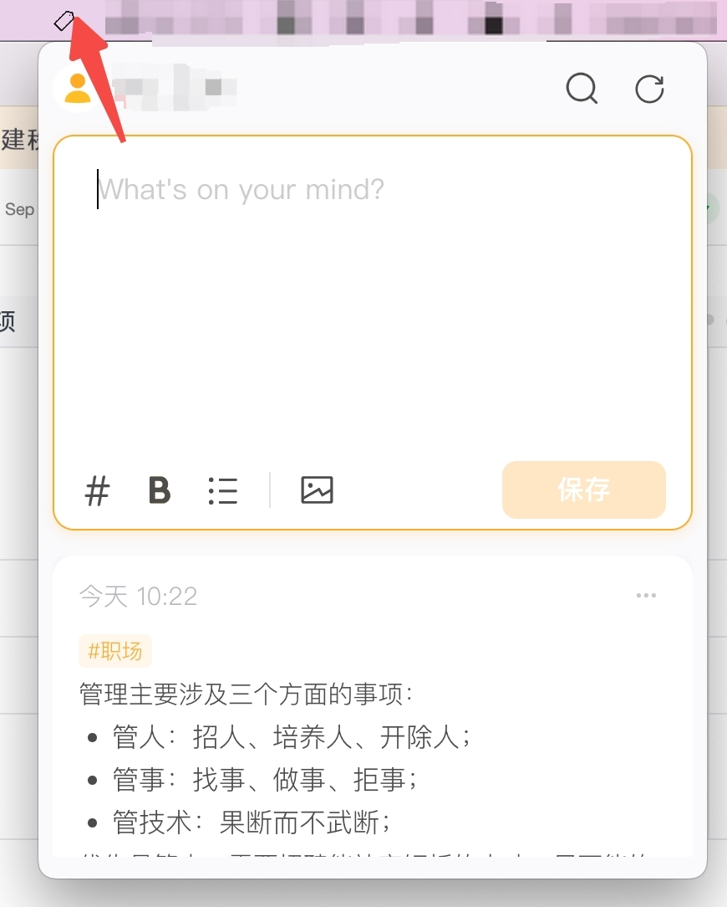
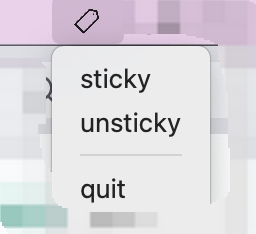

## 概述

因为 Mac 的印象[轻记](https://staging.yinxiang.com/product/lightnote/)是包含在印象笔记 App 中，使用的时候非常的不方便，轻记变成了记笔记，成本甚高。看印象笔记的迭代趋势，短时间内（设置以后）都不会单独开发一个 App，故基于 electron 搞了一个客户端版本，基于其网页版简单封装，因为是自用，故只有针对 Mac 的适配:



置顶 menu



## 功能

1. 采用系统托盘方式，支持全局快捷键(Command+Option+N)，操作更加轻便；
2. 支持窗口置顶/取消置顶功能（右键点击系统托盘图标），方便某些阅读场景或开会场景记录等；
3. 支持自动登录账号，降低使用成本，每一次打开时都会自动检测是否登录过期，保证功能正常；
4. 注入自定义样式，调整输入框高度，更加符合输入的习惯

## 使用指南

因为自用，因需要添加账号/密码信息，方案是需要自行构建：

1. 拉去代码仓库的代码
2. 安装依赖

```
yarn install
```

3. 修改`preload.js`文件中的`ACCOUNT` 和 `PASSWORD`变量，填写对应的印象轻记的账号密码，本地预览:

```
yarn start
```

4. 构建 App

```
yarn make
```

在 Mac 下，可以将构建的产物`out/quick-note-darwin-x64/quick-note.app`移动到 `Application`目录下，方便快捷打开
